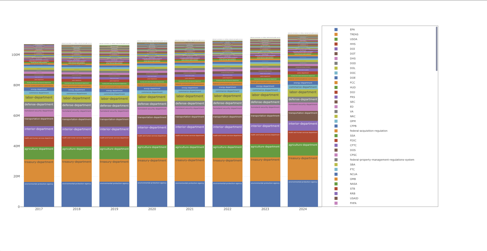

# Getting Started

## Requirements

- [Node.js](https://nodejs.org/en)
- [Yarn](https://yarnpkg.com/)
- [Python 3](https://www.python.org/)

## Initial Setup

In the project directory, create python virtual environment.

### `cd api`

### `python3 -m venv venv`

Activate the virtual environment.

### Linux/Mac: `source venv/bin/activate`

### Windows: `venv\Scripts\activate`

Inside of the virtual environment, install python dependencies:

### `pip install flask python-dotenv setuptools urllib3 utils`

Once complete, deactive the virtual environment.

### `deactivate`

From the `api` directory, download the ecfr data:

### `python3 download.py`

From the `api` directory, analyze the ecfr data:

### `python3 analysis.py`

### `cd ..`

## Running

From the main directory, start the API.

### Linux/Mac: `yarn start-api-unix`

### Windows: `yarn start-api-windows`

From the main directory, install dependencies and start the frontend.

### `yarn`

### `yarn start`

Runs the app in the development mode.\
Open [http://localhost:8000/](http://localhost:8000/) to view it in your browser.

The page will reload when you make changes.\
You may also see any lint errors in the console.

## Goals

- Primary
  - Download Federal Regulations from https://www.ecfr.gov/
  - Analyze for word count per agency and historical changes over time
  - Front end visualization to interact with content and query items
- Stretch
  - Idenfity and visualize more metrics
  - Parse and visualize dependencies as a network
